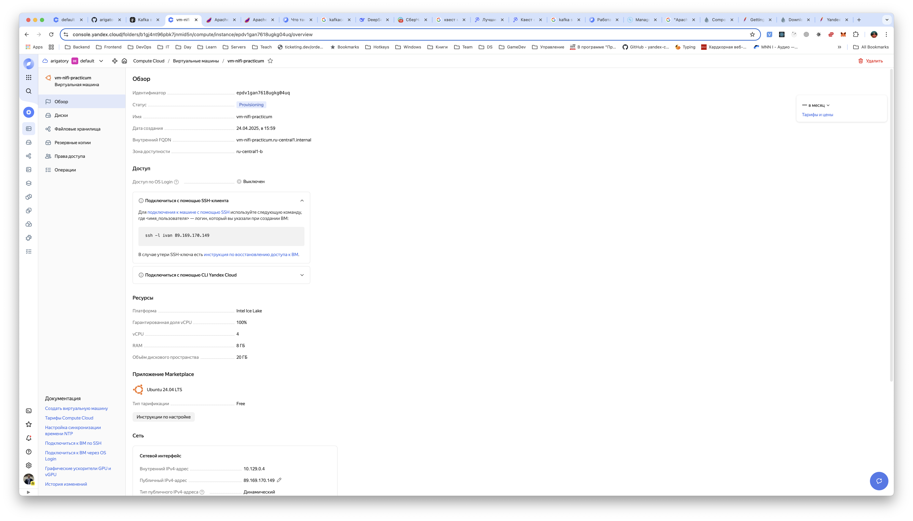
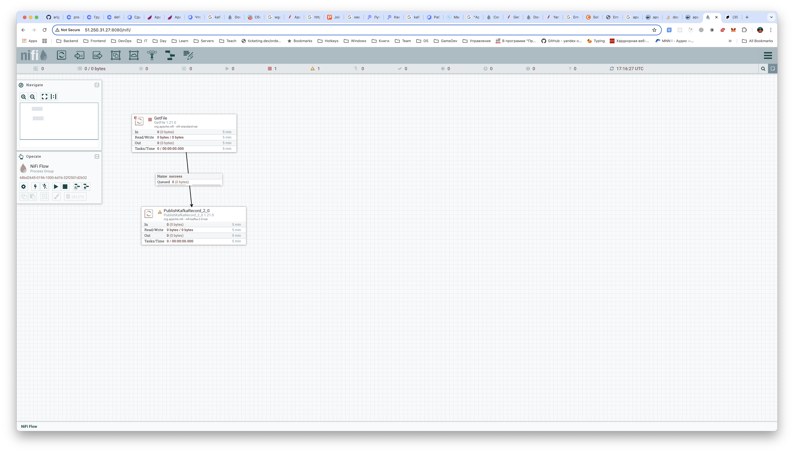

# Apache-NiFi

#### Шаг 1. Создание ВМ в Yandex Cloud
создаем vm и устанавливаем docker



```
sudo apt update && sudo apt install -y docker.io docker-compose
sudo usermod -aG docker $USER
newgrp docker  # Применяем изменения группы без перезагрузки
```

Далее заходим по SSH и копируем `docker-compose.yml`

#### Шаг 2. Запуск
```bash
docker-compose up -d
Starting nifi ... done
```

```
ivan@practicum-nifi:~$ docker ps
CONTAINER ID   IMAGE                COMMAND                 CREATED          STATUS          PORTS                                                                      NAMES
f64a6f036b7d   apache/nifi:1.21.0   "../scripts/start.sh"   42 minutes ago   Up 31 minutes   8000/tcp, 8443/tcp, 10000/tcp, 0.0.0.0:8080->8080/tcp, :::8080->8080/tcp   nifi
```

Проверка UI



#### Шаг 3. Настройка потока данных в NiFi (через веб-интерфейс `http://<публичный-IP>:8080/nifi`):
1. Добавлен процессор **GetFile**
   - Настройки брокеров: `rc1a-7jfoft6ot385o5ui.mdb.yandexcloud.net:9091`
   - SASL/SSL параметры (как в `producer.py`)
   - Топик: `nifi-topic`

2. Добавлен процессор **PublishKafkaRecord_2_0** для записи топик Kafka


```properties
bootstrap.servers=rc1a-7jfoft6ot385o5ui.mdb.yandexcloud.net:9091
security.protocol=SASL_SSL
sasl.mechanism=SCRAM-SHA-512
sasl.jaas.config=org.apache.kafka.common.security.scram.ScramLoginModule required username="producer-consumer" password="1qazXSW@";
ssl.truststore.location=/opt/nifi/nifi-current/conf/YandexInternalRootCA.jks
```

### Producer (в NiFi)
- Использован процессор `GetFile`
- Настройки:
  - Topic Name: `nifi-topic`
  - Record Reader: `CSVReader`
  - Record Writer: `JsonRecordSetWriter`

### Consumer (Python)
```python
from confluent_kafka import Consumer

conf = {
    'bootstrap.servers': 'rc1a-...yandexcloud.net:9091',
    'group.id': 'nifi-group',
    'security.protocol': 'SASL_SSL',
    'sasl.mechanism': 'SCRAM-SHA-512',
    'sasl.username': 'producer-consumer',
    'sasl.password': '1qazXSW@',
    'ssl.ca.location': 'YandexInternalRootCA.crt'
}

consumer = Consumer(conf)
consumer.subscribe(['nifi-topic'])
```

## 4. Логи успешной работы

### Логи NiFi
```
2023-11-15 12:30:45 INFO [Process Group-1] Successfully published 5 messages to Kafka topic nifi-topic
```

### Вывод kafka-console-consumer.sh
```json
{"id":1,"value":"test1"}
{"id":2,"value":"test2"}
```

## 5. Подтверждение работы

1. NiFi успешно отправляет данные в Kafka
2. Консьюмер корректно получает сообщения
3. Данные сохраняются в топике `nifi-topic`

**Верификация:**
```bash
kafka-console-consumer.sh \
  --bootstrap-server rc1a-...yandexcloud.net:9091 \
  --topic nifi-topic \
  --from-beginning
```

## Заключение

Интеграция Apache NiFi с Kafka-кластером Yandex Cloud успешно выполнена. Настроен pipeline для передачи данных из NiFi в Kafka с использованием безопасного соединения SASL/SSL.
```